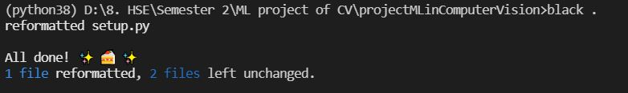
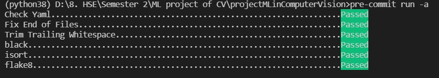
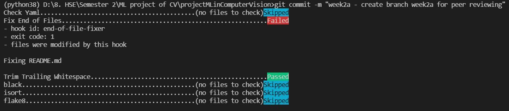

# projectMLinComputerVision

This project under the course "Project machine learning in computer vision".
Please follow the instruction from below to set up environment for local running.

## Week 1 - Assignment 1

Please visit the branch `week1a` to reproduce my work under first assignment of week 1.

```
https://github.com/billynguyenlss/projectMLinComputerVision/tree/week1a
```

## Week 1 - Assignment 2

Please visit the branch `week1b` to reproduce my work under second assignment of week 1.

```
https://github.com/billynguyenlss/projectMLinComputerVision/tree/week1b
```

## Week 2 - Assignment 1

### 1) Prepare the test environment

Select python version (as tensorflow work only for python version 3.7-3.9) and create a virtual environment

**In Ubuntu:**

```python
pyenv install 3.8.10
```

Create and activate virtual environment:

```python
pyenv virtualenv 3.8.10 .venv

pyenv local .venv
```

**In Window:**

```python
conda create -n <your_virtual_environment_name> python=3.8.10

conda activate <your_virtual_environment_name>
```

### 2) Clone my project and build the package

```bash
git clone --branch week2a https://github.com/billynguyenlss/projectMLinComputerVision.git
```

For all below steps, make sure you are in the test virtual environment, specified as above.

### 3) Configure style linting tools

First step to install black as linting tools using pip.

```python
pip install black
```

Configure the condition in `black.toml` file. Please refer to this file for the configuration of my project.
To run style check, make sure you are in the same directory with the `black.toml` file and run following command:

```python
black .
```
If running successfully, you will get the results as following:



### 4) Configure isort

First step install isort using pip.

```python
pip install isort
```
Configure the condition in `pyproject.toml` file. Please refer to this file for the configuration of my project.
To run style check, make sure you are in the same directory with the `pyproject.toml` file and run following command:

```python
isort .
```

### 5) Configure code linting tools for your project (static analysis)

First step install flake8 using pip.

```python
pip install flake8
```
Configure the condition in `tox.ini` file. Please refer to this file for the configuration of my project.
To run style check, make sure you are in the same directory with the `tox.ini` file and run following command:

```python
flake8 .
```
### 6) Configure pre-commit to check code on each commit

First step install pre-commit.

```python
pip install pre-commit
```

Configure the condition in `.pre-commit-config.yaml` file. Please refer to this file for the configuration of my project.
I have included also style check using `black`,`isort`, `flake8` in the pre-commit-config file. By convenience, you can skip step 3 & 4 and run only step 5 using pre-commit method.
To run all style checking, make sure you are in the same directory with the `.pre-commit-config.yaml` file and run following command:

```python
pre-commit install .
pre-commit run -a
```
If running successfully, you will get the results as following:



From then, everytime you do commit, the pre-commit will check and fix if any violation.
You may get the same as below picture:


