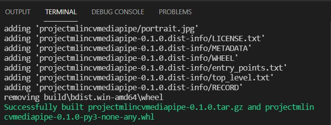

# projectMLinComputerVision

This project under the course "Project machine learning in computer vision".
Please follow the instruction from below to set up environment for local running.

## Week 1 - Assignment 1

Please visit the branch `week1a` to reproduce my work under first assignment of week 1.

```
https://github.com/billynguyenlss/projectMLinComputerVision/tree/week1a
```

## Week 1 - Assignment 2

### 1) Prepare the development environment

Select python version (as tensorflow work only for python version 3.7-3.9) and create a virtual environment

**In Ubuntu:**

```python
pyenv install 3.8.10
```

Create and activate virtual environment:

```python
pyenv virtualenv 3.8.10 .venv

pyenv local .venv
```

**In Window:**

```python
conda create -n <your_virtual_environment_name> python=3.8.10

conda activate <your_virtual_environment_name>
```

### 2) Clone my project and build the package

git clone --branch week1b https://github.com/billynguyenlss/projectMLinComputerVision.git

To rebuild the project, run following command at the same directory with the `setup.py`

**In Window:**
```python
python3 -m pip install --upgrade build
python3 -m build
```

**In Ubuntu:**
```python
py -m pip install --upgrade build
py -m build
```
Once successful build, you will get the same as below picture:



### 3) Install the package from github repo

